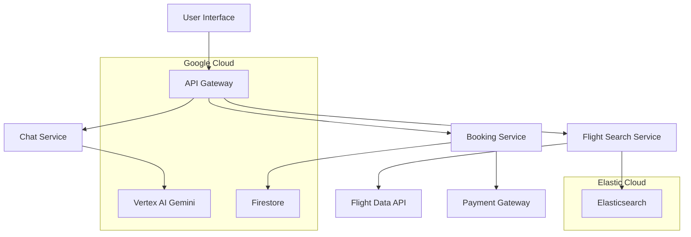

# Design Document

## Overview

The AI-Powered Flight Booking Assistant combines Elastic's search capabilities with Vertex AI to create a conversational flight booking experience. The system uses Elasticsearch to index and search flight data, while Vertex AI powers natural language understanding for travel queries and booking assistance.

## Architecture



### Technology Stack

- **Frontend**: React.js with chat interface
- **Backend**: Node.js with Express.js
- **Search**: Elasticsearch for flight data indexing
- **AI**: Vertex AI Gemini for conversation and query understanding
- **Database**: Firestore for bookings and user data
- **Payment**: Stripe for secure payment processing
- **Infrastructure**: Google Cloud Run

## Components and Interfaces

### 1. Natural Language Processing Service

**Responsibilities:**
- Parse travel queries from natural language
- Extract travel parameters (dates, destinations, passengers)
- Handle conversational context and follow-ups

**Key Interfaces:**
```typescript
interface TravelQuery {
  userMessage: string;
  sessionId: string;
  context?: ConversationContext;
}

interface ExtractedTravelParams {
  origin?: string;
  destination?: string;
  departureDate?: Date;
  returnDate?: Date;
  passengers: number;
  class?: 'economy' | 'business' | 'first';
  flexibility?: 'exact' | 'flexible';
}
```

### 2. Flight Search Service

**Responsibilities:**
- Query flight data from Elasticsearch
- Apply filters and sorting
- Return ranked flight options

**Key Interfaces:**
```typescript
interface FlightSearchRequest {
  origin: string;
  destination: string;
  departureDate: Date;
  returnDate?: Date;
  passengers: number;
  filters?: FlightFilters;
}

interface FlightResult {
  id: string;
  airline: string;
  flightNumber: string;
  origin: Airport;
  destination: Airport;
  departureTime: Date;
  arrivalTime: Date;
  duration: number;
  stops: number;
  price: number;
  availableSeats: number;
}
```

### 3. Conversation Service

**Responsibilities:**
- Manage chat sessions
- Generate contextual responses
- Guide users through booking process

**Key Interfaces:**
```typescript
interface ConversationRequest {
  message: string;
  sessionId: string;
  userId?: string;
  flightResults?: FlightResult[];
}

interface ConversationResponse {
  message: string;
  flightOptions?: FlightResult[];
  suggestedActions?: string[];
  bookingStep?: BookingStep;
}
```

### 4. Booking Service

**Responsibilities:**
- Handle flight reservations
- Process payments
- Manage booking lifecycle

**Key Interfaces:**
```typescript
interface BookingRequest {
  flightId: string;
  passengers: PassengerInfo[];
  contactInfo: ContactInfo;
  paymentInfo: PaymentInfo;
}

interface BookingConfirmation {
  bookingReference: string;
  status: 'confirmed' | 'pending' | 'failed';
  totalPrice: number;
  flights: FlightDetails[];
  passengers: PassengerInfo[];
}
```

## Data Models

### Flight Model
```typescript
interface Flight {
  id: string;
  airline: string;
  flightNumber: string;
  aircraft: string;
  origin: Airport;
  destination: Airport;
  departureTime: Date;
  arrivalTime: Date;
  duration: number;
  stops: Airport[];
  price: PriceInfo;
  availability: SeatAvailability;
  policies: FlightPolicies;
}

interface Airport {
  code: string;
  name: string;
  city: string;
  country: string;
  timezone: string;
}
```

### Booking Model
```typescript
interface Booking {
  id: string;
  bookingReference: string;
  userId: string;
  status: 'confirmed' | 'cancelled' | 'completed';
  flights: Flight[];
  passengers: PassengerInfo[];
  totalPrice: number;
  paymentStatus: 'paid' | 'pending' | 'refunded';
  createdAt: Date;
  travelDate: Date;
}
```

### User Session Model
```typescript
interface UserSession {
  sessionId: string;
  userId?: string;
  currentQuery?: ExtractedTravelParams;
  conversationHistory: ConversationMessage[];
  searchResults?: FlightResult[];
  selectedFlight?: FlightResult;
  bookingInProgress?: Partial<BookingRequest>;
}
```

## Error Handling

### Search Errors
- **No flights found**: Suggest alternative dates or nearby airports
- **Invalid destinations**: Provide airport suggestions and clarifications
- **Date parsing errors**: Ask for clarification on travel dates

### Booking Errors
- **Payment failures**: Retry mechanisms and alternative payment methods
- **Seat unavailability**: Offer alternative flights or seat options
- **Validation errors**: Clear guidance on required passenger information

### AI Service Errors
- **Vertex AI unavailable**: Fallback to structured search forms
- **Query understanding failures**: Ask clarifying questions
- **Context loss**: Graceful conversation restart

## Testing Strategy

### Unit Testing
- **Query parsing**: Test natural language extraction accuracy
- **Flight search**: Test filtering, sorting, and ranking logic
- **Booking flow**: Test reservation and payment processing
- **Conversation logic**: Test response generation and context management

### Integration Testing
- **Elasticsearch integration**: Test flight data indexing and search
- **Vertex AI integration**: Test conversation and query understanding
- **Payment integration**: Test secure payment processing
- **External APIs**: Test flight data provider connections

### End-to-End Testing
- **Complete booking flow**: From search to confirmation
- **Multi-passenger bookings**: Test complex reservation scenarios
- **Conversation continuity**: Test context preservation across interactions
- **Error recovery**: Test graceful handling of various failure modes